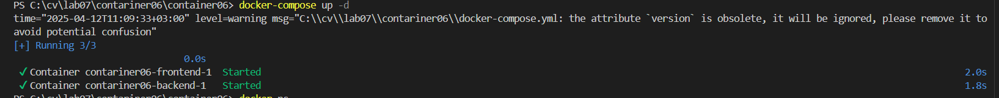
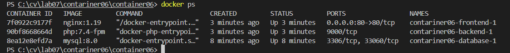

# Crearea unei aplicații multi-container
# Scopul lucrării
Famialiarizarea cu gestiunea aplicației multi-container creat cu docker-compose.

# Sarcina
Creem o aplicație php pe baza a trei containere: nginx, php-fpm, mariadb, folosind docker-compose.

# Realizare
1. am clonat repozitoriul si am creat directoriile mounts/site, nginx si fisierele .gitignore, docker-compose.yml si mysql.env
2. in directoriul nginx am creat fisierul default.conf si am adaugat continutul necesar
3. in directoriile mounts/sites am adaugat fisierul index.php cu pagina php.
4. am pornit containerele cu docker-compose up -d

# Raspunsiri la intrebari
## În ce ordine sunt pornite containerele?
Containerele sunt pornite în ordinea dependențelor stabilite în fișierul docker-compose.yml. În cazul nostru, nu sunt definite explicit dependențe între servicii (nu există directive depends_on), dar Docker Compose va încerca să le pornească în ordinea în care sunt definite: mai întâi frontend, apoi backend și în final database.

## Unde sunt stocate datele bazei de date?
Datele bazei de date sunt stocate într-un volum Docker numit db_data definit în secțiunea volumes a fișierului docker-compose.yml. Acest volum persistă datele chiar și după ce containerele sunt oprite sau șterse.

## Cum se numesc containerele proiectului?

## Trebuie să adăugați încă un fișier app.env cu variabila de mediu APP_VERSION pentru serviciile backend și frontend. Cum se face acest lucru?
Mai întâi, creezi fișierul app.env în directorul rădăcină cu conținutul:
APP_VERSION=1.0.0
Apoi, modifici fișierul docker-compose.yml pentru a adăuga acest fișier la secțiunile frontend și backend: 
pentru frontend: 
env_file:
    - app.env

pentru backend:
env_file:
    - mysql.env
    - app.env